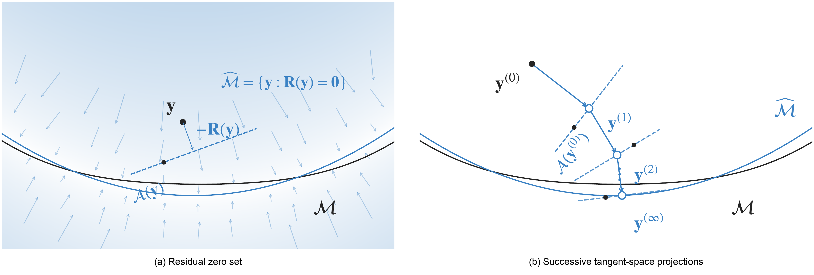

# Successive Tangent-Space Projection

Manifold fitting from noisy data through successive local tangent-space projections.



**Implicit and explicit manifold fitting.**

## Overview

<div class="justify-text">
Noisy observations can obscure the curved, low-dimensional structure of a data set. Successive Tangent-Space Projection (STSP) fits this structure by repeatedly projecting points onto locally estimated affine tangent spaces. Each update uses the same reference sample, while the local neighbourhood and tangent space change with the point being fitted.
<br><br>
The fitted manifold is characterised through the nearby population fixed points of these updates. Under small-noise conditions, this fixed-point set lies close to the underlying manifold and preserves its smooth structure and topology. Population iterations started sufficiently nearby converge geometrically; the finite-sample analysis describes a geometric transient followed by an error neighbourhood determined by noise and sample size.
<br><br>
A three-scale extension, MS-STSP, combines fitted representations to reduce curvature-induced shrinkage observed at higher noise levels. Experiments on synthetic curves and surfaces assess both fitting accuracy and geometric coverage. A single-cell gene-expression application examines the fitted representations through clustering measures and visualisation.
</div>

The implementation code is available on GitHub: :material-arrow-right: <a href="https://github.com/zhigang-yao/STSP" class="btn-href">:simple-github:</a>

To cite: :material-arrow-down:

```bibtex
@techreport{xia_stsp,
  title={Manifold Fitting by Successive Tangent-Space Projection},
  author={Xia, Yuqing and Li, Bingjie and Yao, Zhigang},
  type={Technical report}
}
```
